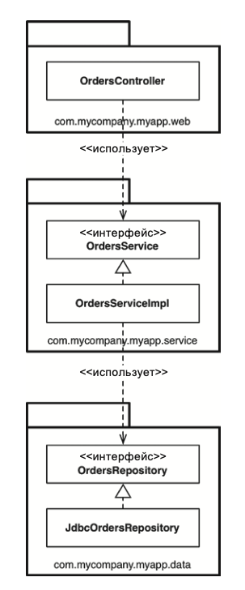
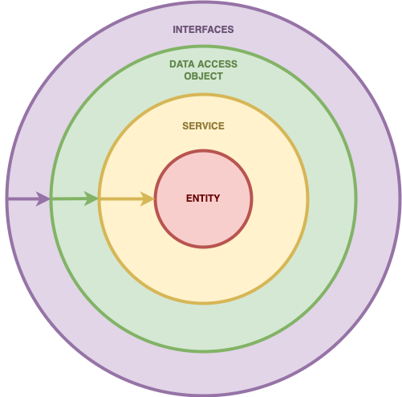
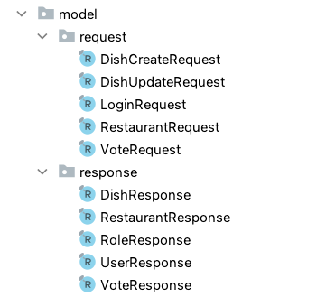
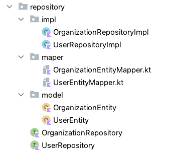

# Архитектурные решения

В качестве основных архитектурных правил мы придерживаемся принципов [S.O.L.I.D.](https://habr.com/ru/post/508086/) 
В стиле кода мы придерживаемся [Google Java Style Guide](https://habr.com/ru/post/513176/) для Java и [Kotlin Coding Conventions](https://habr.com/ru/articles/708074/) для Kotlin (с опущением некоторых правил).

---

## Спорные правила Kotlin Coding Conventions

| Правило                                                                                                                                                                                                                                                       | Комментарий                                                                                                                                                                                                                                                                                                                                                                                                                                                                                                                                                                                                                                                                                                                              |
|---------------------------------------------------------------------------------------------------------------------------------------------------------------------------------------------------------------------------------------------------------------|------------------------------------------------------------------------------------------------------------------------------------------------------------------------------------------------------------------------------------------------------------------------------------------------------------------------------------------------------------------------------------------------------------------------------------------------------------------------------------------------------------------------------------------------------------------------------------------------------------------------------------------------------------------------------------------------------------------------------------------|
| Мы приветствуем размещение нескольких программных сущностей (классы, верхнеуровневые функции / переменные) в одном файле, если эти сущности тесно связаны друг с другом семантически, а размер файла остаётся разумным и не превышает нескольких сотен строк. | Контроллер, сервис, репозиторий, бизнес-сущность, модель DAO, мапер - все эти типы компонентов слишком разные и каждый имеет слишком чёткую функциональную нагрузку, чтобы смешивать их в одном файле. "Луковичная архитектура" кричит от негодования, ей вторят Роберт Мартин и Мартин Фаулер.<br/><br/>Возможно, такая архитектура приложения подойдёт для совсем уж маленьких проектов или пилотов, не планируемых к расширению. В развивающихся проектах, такие файлы всё равно рано или поздно придётся дробить по пакетам, и процесс будет очень сложным, поскольку IDEA не умеет вычленять классы / интерфейсы из общего файла; для программных сущностей с большим количеством зависимостей такой рефакторинг станет сущим адом. |
| Содержимое класса должно располагаться в следующем порядке:<br/> 1. Объявления полей и блоки инициализации.<br/>2. Вторичные конструкторы.<br/>3. Функции.<br/>4. Объект-компаньон.                                                                           | Объект-компаньон в архитектуре языка соответствует статическим элементам Java. Статические элементы в Java принято размещать в начале объявления класса, перед компонентами-членами, а не в конце. Это также соответствует общей для языков Java и Kotlin концепции, согласно которой, общие компоненты располагаются выше компонентов-членов.                                                                                                                                                                                                                                                                                                                                                                                           |
| Если в классе есть два концептуально одинаковых поля, одно из которых является частью общепринятого API, а второе - деталью реализации, используйте в имени приватного поля нижнее подчёркивание в качестве префикса                                          | "Венгерская нотация" считается устаревшей, независимо от причин её использования.                                                                                                                                                                                                                                                                                                                                                                                                                                                                                                                                                                                                                                                        |
| Использовать имена, состоящие из нескольких слов, как правило, не рекомендуется, но если это необходимо, Вы можете соединить их вместе или использовать Camel Case (org.example.myProject).                                                                   | Имена пакетов в camelCase - один из самых неожиданных пунктов в Kotlin Coding Convention. Возможно, эта привычка переехала из Android Studio, которая имеет более жёсткие правила в части допустимых символов.                                                                                                                                                                                                                                                                                                                                                                                                                                                                                                                           |
| Для перечислений (enum), допускается использовать или Screaming Snake Case (enum class Color { RED, GREEN }), или Upper Camel Case.                                                                                                                           | Значения перечислений принято описывать только в SCREAMING_SNAKE_CASE. Будет выглядеть странно, если часть перечислений будет в SCREAMING_SNAKE_CASE, а часть в Upper Camel Case.                                                                                                                                                                                                                                                                                                                                                                                                                                                                                                                                                        |

## Верхнеуровневая компоновка приложения

Мы придерживаемся компоновки по уровням. Компоновка по уровням подразумевает создание пакетов на верхнем уровне, разделённых по слоям. Например, `controller`, `service`, `repository` и так далее.



Более подробно этот способ компоновки описан в статье Симона Брауна "Недостающая глава" книги Роберта Мартина "Чистая архитектура".

Компоновка по уровням является одной из реализаций "луковичной" архитектуры, смысл которой сводится к изображению "луковицы", в центре которой находится бизнес-сущность, которая ничего не знает о реализации приложения.
Её окружает бизнес-слой, который знает только про бизнес-сущность и ни про что более.
Бизнес-сущность окружает слой DAO (Data Access Object), который служит для подключения к внешним интерфейсам.
Слой DAO окружают внешние интерфейсы, которые не являются частью приложения.



Таким образом, приложение состоит из следующих основных пакетов:

| Название     | Функциональность                                                                                                                                            |
|--------------|-------------------------------------------------------------------------------------------------------------------------------------------------------------|
| `client`     | Интеграция с внешними системами. Часть слоя DAO.                                                                                                            |
| `controller` | API приложения. Часть слоя DAO.<br/>По умолчанию, запросы происходят по протоколу HTTP с использованием архитектуры REST. Формат данных по умолчанию: JSON. |
| `exception`  | Кастомные исключения и их обработка.                                                                                                                        |
| `entity`     | Бизнес-сущности.                                                                                                                                            |
| `repository` | Репозиторий. Часть слоя DAO.                                                                                                                                |
| `service`    | Бизнес-логика.                                                                                                                                              |
| `util`       | Утилитные функции.                                                                                                                                          |

## Описание пакета controller

### Архитектура моделей

Архитектура моделей содержит в себе следующие пакеты:

| Название         | Описание                                                                                                                                                                                                                                                                                                                                                                                                     |
|------------------|--------------------------------------------------------------------------------------------------------------------------------------------------------------------------------------------------------------------------------------------------------------------------------------------------------------------------------------------------------------------------------------------------------------|
| `model`          | Верхнеуровневый пакет моделей API.<br/>В большинстве случаев, модели запроса и ответа отличаются. Мы стараемся сделать модели наиболее эргономичными, поэтому мы реализуем отдельно запрос и ответ для тех случаев, где это необходимо. Также, мы реализуем разные запросы и ответы для разных задач. Например, `UserCreateRequest`, `UserUpdateRequest`, `UserResponse`, `UserResponseWithoutDependencies`. |
| `model.request`  | Содержит модели запроса.                                                                                                                                                                                                                                                                                                                                                                                     |
| `model.response` | Содержит модели ответа.                                                                                                                                                                                                                                                                                                                                                                                      |
| `mapper`         | Маперы для каждой модели.                                                                                                                                                                                                                                                                                                                                                                                    |

Пример реализации пакетов:



### Архитектура эндпоинтов

Мы придерживаемся классической REST-архитектуры. Для различных операций - различные HTTP-методы.

| HTTP-метод | Функциональность                                                                                                                                                                                       |
|------------|--------------------------------------------------------------------------------------------------------------------------------------------------------------------------------------------------------|
| `POST`     | Сохранение.<br/>Под сохранением подразумевается создание новой сущности на физическом носителе. Операция не является идемпотентной.                                                                    |
| `PUT`      | Изменение.<br/>Под изменением подразумевается изменение свойств существующей сущности на физическом носителе. Операция является идемпотентной.                                                         |
| `GET`      | Получение данных, без их изменения. Операция является идемпотентной.                                                                                                                                   |
| `DELETE`   | Удаление данных.<br/>Под удалением подразумевается невозможность дальнейшего использования сущности в логике приложения. Удаление может быть физическим или "мягким". Операция является идемпотентной. |

#### Почему мы не используем метод PATCH

Мы не используем метод PATCH, поскольку он подразумевает обновление только тех полей, которые были получены. 
Такой подход имеет несколько недостатков.

При получении модели, для которой нужно обновить произвольные поля, мы должны или иметь репозиторий, который будет знать, какие поля должны быть обновлены, или обновлять существующую модель, поля которой будут обогащены полученными значениями. 
Если мы решаем проблему на стороне репозитория, тогда нам нужно проверять, что поле не null и апдейтить только его. 
Например:

```kotlin
CalculationTypeEntity.update({ CalculationTypeEntity.id eq calculationType.id!! }) {
    calculationType.name?.also {ct -> it[name] = ct }
    //и так далее для всех полей
}
```

Для этого, все поля бизнес-сущности придётся сделать nullable в угоду репозиторию. 
Что нарушает луковичную архитектуру - бизнес-сущность подстраивается под работу репозитория.

Если же мы решаем проблему через обогащение уже хранящейся сущности, нам придётся сделать лишний запрос в базу данных. 
Выглядеть это будет следующим образом:

```kotlin
fun toCalculationIndicatorTypeUpdatedOnly(request: CalculationIndicatorTypeUpdateRequest): CalculationIndicatorType = let {
        service.get(request.id) //получили сохранённую сущность из базы
            .let {
                request.name?.also { name -> it.name = name } //обновляем значение, если поле не null
                //и так для каждого поля
            }
    }
```

Главный же минус такого подхода: мы не сможем поле, для которого уже было проставлено значение, сделать обратно null - если оно придёт null, это будет сигналом, что поле обновлять не нужно.
Совмещение же обоих подходов привнесёт путаницу в код.

Архитектура REST подразумевает строго иерархическую структуру запроса, где сначала следует родительская сущность, далее её идентификатор, далее указание на зависимую сущность.

Например, запрос получения всех блюд для ресторана будет выглядеть так:

`/restaurant/{id}/dishes/all`

Запрос на связывание блюда и ресторана будет выглядеть так:

`/restaurant/{id}/bind/dish/{id}`

Ключи передаются через переменные пути. 
Общие параметры (например, параметры фильтрации или пейджинга) передаются как параметры запроса.

Пример реализации контроллера:

```kotlin
@RestController
@RequestMapping("/user")
class UserControllerImpl(
    private val service: UserService
) : UserController {
 
    @PostMapping
    override fun create(@RequestBody request: UserCreateRequest): ResponseEntity<UserResponse> =
        request
            .toUser()
            .let { service.create(it) }
            .toResponse()
            .let { ResponseEntity.ok(it) }
 
    @PutMapping
    override fun update(@RequestBody request: UserUpdateRequest): ResponseEntity<Unit> =
        request
            .toUser()
            .also { service.update(it) }
            .let { ResponseEntity.ok().build() }
 
    @GetMapping
    override fun get(id: UUID): ResponseEntity<UserResponse> =
        service.get(id)
            .toResponse()
            .let { ResponseEntity.ok(it) }
 
    @GetMapping("/all")
    override fun getAll(
        @RequestParam filterParams: FilterParams,
        @RequestParam page: Int,
        @RequestParam size: Int
    ): ResponseEntity<Page<UserResponse>> =
        service
            .getAll(filterParams, page, size)
            .let { ResponseEntity.ok(it) }
 
    @DeleteMapping
    override fun delete(id: UUID): ResponseEntity<Unit> =
        service.delete(id)
            .let { ResponseEntity.ok().build() }
}
```

## Описание пакета entity

В пакете entity содержатся бизнес-сущности.

Мы стараемся делать бизнес-сущности эргономичными. 
При проектировании мы создаём "жирную" бизнес-сущность, со всеми зависимыми бизнес-сущностями. 
Далее, по ходу развития приложения, могут быть созданы более "лёгкие" подвиды сущностей, позволяющие облегчить запрос получения такой бизнес-сущности из DAO. 
Такие сущности имеют узкую специализацию в рамках своих задач.

Пример "жирной" сущности и её более лёгкого подвида:

```kotlin
data class ConfirmationByDocument(
    val id: UUID? = null,
    val transferRelation: TransferRelation,
    val confirmationDocument: Document,
    val organization: Organization,
    val paidDate: LocalDate,
    val status: ConfirmationStatus,
    val statusMessage: String? = null,
    val domainId: UUID
)
 
//в рамках реализуемой задачи бизнес-сущности не требуются статус, полные зависимые сущности (только id), а также, документ подтверждения и домен
data class ConfirmationByDocumentSimple(
    val id: UUID? = null,
    val transferDocumentId: UUID,
    val organizationId: UUID,
    val paidDate: LocalDate
)
```

## Описание пакета service

В этом слое инкапсулирована вся бизнес-логика. 
Логический слой содержит интерфейсы как неизменяемые контракты. 
Реализации содержатся в отдельном пакете impl.

Слой бизнес-логики не содержит никаких ссылок на DAO, кроме ссылок на интерфейсы. 
Интерфейсы DAO являются лишь контрактами, без ссылок на реализацию. 
Таким образом, соблюдается чистота архитектуры.

## Описание пакета repository

Пакет repository включает в себя интерфейсы репозиториев и пакеты с реализациями. 
Скорее всего, в реальности будет только одна реализация, но архитектура никак не ограничивает другие реализации - например, через Spring Data JPA, QueryDSL, JOOQ, Exposed или JDBC. 
В таком случае, будут добавлены пакеты jpa, jooq и так далее, в которых будут реализованы интерфейсы.

Для хранения репозиторной сущности и мапинга её с бизнес-сущностью используются пакеты entity и mapper.

| Пакет    | Функциональность                                                                                                                    |
|----------|-------------------------------------------------------------------------------------------------------------------------------------|
| `entity` | Содержит в себе репозиторные сущности.<br/>Мы разделяем бизнес-сущности и репозиторные сущности, согласно "луковичной" архитектуре. |
| `mapper` | Маперы бизнес-сущности и репозиторной сущности.                                                                                     |

Пример архитектуры пакета repository:



Как было сказано выше, преобразование репозиторных сущностей происходит в мапере. 
Поскольку для разных задач может быть несколько подвидов одной и той же бизнес-сущности, в таком мапере будут содержаться все мапинги на все подвиды бизнес-сущности, а также, обратное преобразование из бизнес-сущности в репозиторную.

```kotlin
fun ResultRow.toUser(): User = User(
    id = this[UserEntity.id].value,
    name = this[UserEntity.name]
)
 
fun ResultRow.toUserIdOnly(): UserIdOnly = UserIdOnly(
    id = this[UserEntity.id].value
)
 
fun User.toInsertStatement(statement: InsertStatement<Number>): InsertStatement<Number> = statement.also {
    it[UserEntity.name] = this.name
}
 
fun User.toUpdateStatement(statement: UpdateStatement): UpdateStatement = statement.also {
    it[UserEntity.name] = this.name
}
```

### Описание пакета util

В пакете util содержатся утилитные функции, не привязанные к конкретной предметной области и вызываемые из любой точки приложения. 
Например, функция <T> T.toJson(): String, преобразовывающая любой объект в строку в формате JSON.