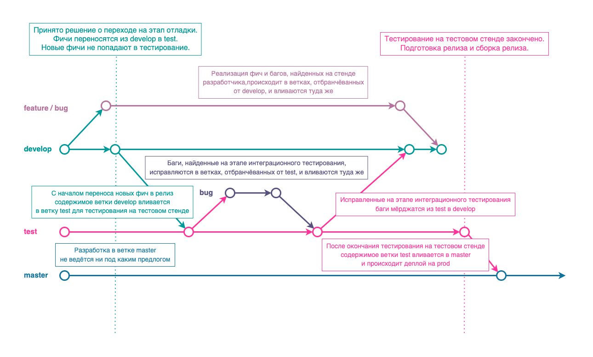

# Релизный цикл

Мы стараемся выстроить релизный цикл, согласно статье [GitFlow в его простоте от dev до prod](https://habr.com/ru/articles/705032/).

Основные тезисы статьи:

1. Существует оптимально три стенда: для разработчиков, для ИФТ / ПСИ, продуктивный.
2. Под каждый из стендов создаётся своя ветка в системе контроля версий.
3. Разработка фич, необходимых к реализации в текущем спринте, происходит в ветке, отбранчёванной от ветки develop. После окончания разработки, содержимое ветки мёрджится обратно в develop и только в неё. Все баги, найденные по итогам этих задач, фиксятся в ветках, образованных от develop.
4. После code-freeze начинается этап отладки. Разработка текущих фич в ветке develop прекращается. Все работы по текущему спринту ведутся в ветке ift. Найденные баги фиксятся в ветках, образованных от ift. После фикса код вливается в ift, ift вливается в develop.
5. Параллельно с этапом отладки в ветке develop может вестись разработка в рамках следующего спринта.
6. В ветке master хранится только код, полностью готовый к релизу.

